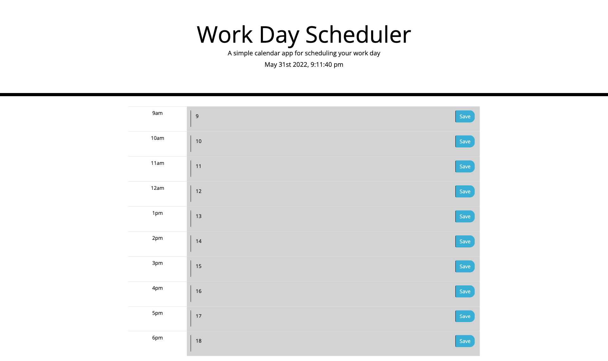

# Work-Schedule

## Table Of Contents
1. [Description](#description)
2. [Visuals](#visuals)
3. [Authors and Acknowledgement](#authors-and-acknowledgement)
4. [Resources](#resources)

## Description 
- In this assignment I classified my html elements with existing classes and styles from the provided css, as well as from bootstrap. I was able to create functions that aplly these styles in coordination with the current time of day. YAY

## Visuals

## Authors and Acknowledgement
- Ben Ashworth

## Resources
[Repo Link]() 

[Live Site]()
 
